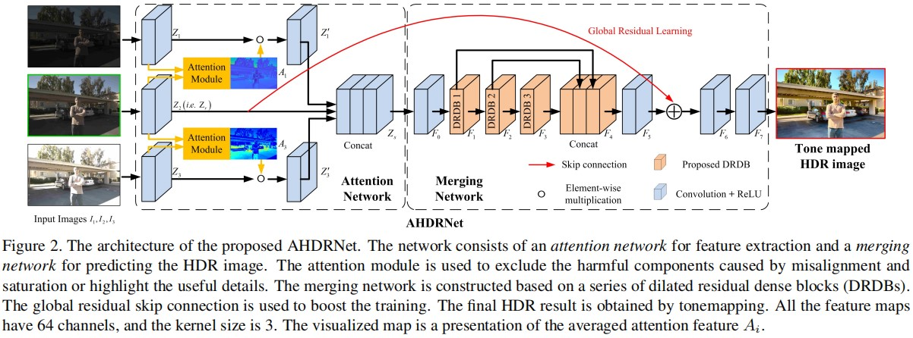

# AHDRNet-PyTorch
- This is the PyTorch implementation of [Attention-guided Network for Ghost-free High Dynamic Range Imaging](https://openaccess.thecvf.com/content_CVPR_2019/papers/Yan_Attention-Guided_Network_for_Ghost-Free_High_Dynamic_Range_Imaging_CVPR_2019_paper.pdf) (CVPR 2019).
- The official code is at [AHDRNet](https://github.com/qingsenyangit/AHDRNet). However, there exists some problems in training and testing within the official implementation which are not solved.



## 1. Environment
- Python >= 3.7
- PyTorch >= 1.4.0
- opencv-python = 4.5.1
- imageio = 2.13.3
- matplotlib

## 2. Dataset
The training data and testing data is from [Kalantari](https://people.engr.tamu.edu/nimak/Data/SIGGRAPH17_HDR_LoRes.pdf) (ACM TOG 2017), the dataset can be downloade from [Kalantari Dataset](https://cseweb.ucsd.edu/~viscomp/projects/SIG17HDR/).

## 3. Quick Demo (Only for tiff format 48-depth images (same with the Kalantari Dataset) now, others in progress)
1. Clone this repository:
    ```
    git clone https://github.com/ytZhang99/AHDRNet-PyTorch.git
    ```
2. Place the test image folders in `./data/Test/`:
    ```
    Test
    └── test_data
        ├── Name_A
        |   ├── 1.tif
        |   ├── 2.tif
        |   ├── 3.tif
        |   ├── exposure.txt
        |   └── HDRImg.hdr (optional)
        └── Name_B
    ```
3. Run the following command to test:
    ```
    python main.py --test_only
    ```
    The output images are placed in `./results/0_epoch/`

## 4. Training
1. Place the training image folders in `./data/Train/`:
    ```
    Train
    └── train_data
        ├── Name_A
        |   ├── 1.tif
        |   ├── 2.tif
        |   ├── 3.tif
        |   ├── exposure.txt
        |   └── HDRImg.hdr
        └── Name_B
    ```
2. Modify the `main.sh` file and run the following command to train:
    ```
    sh main.sh
    ```
    Notice that the default setting of this program is implementing validation on the test dataset after training, you can modify `main.sh` to close the validation progress.
3. The trained model is saved in `./ckp/`, then you can test your own model:
    ```
    python main.py --test_only --model latest.pth
    python main.py --test_only --model best_checkpoint.pth (This model is accessible with validation)
    ```